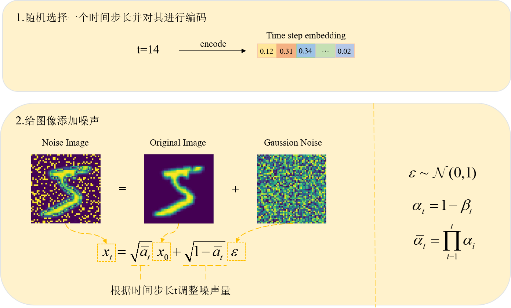
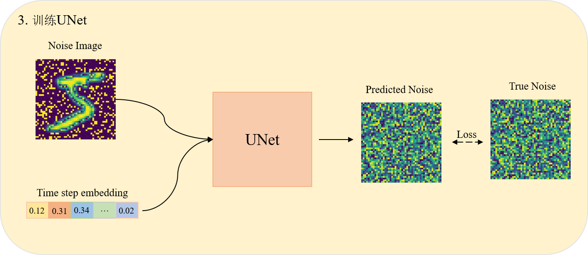
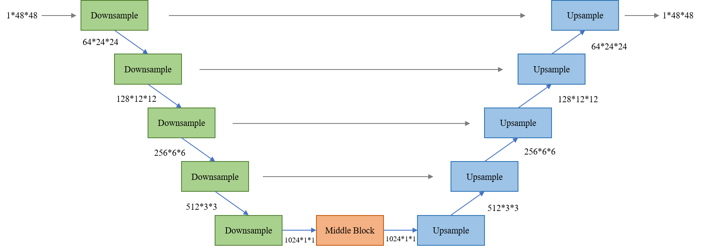
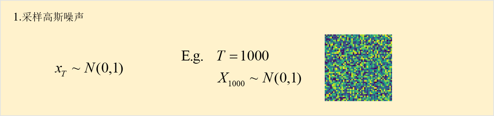
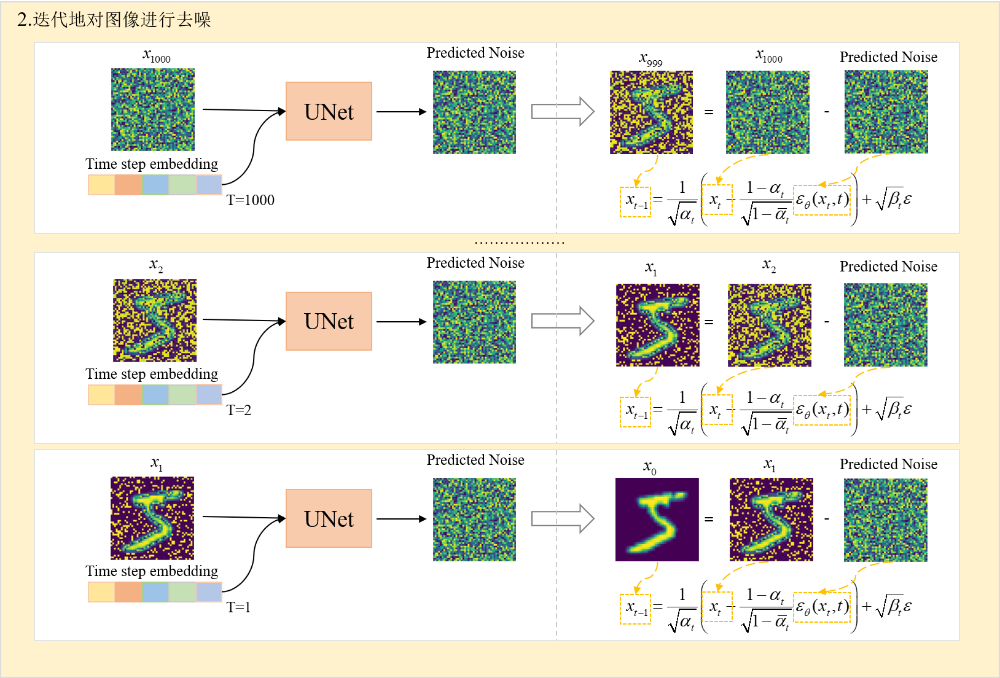
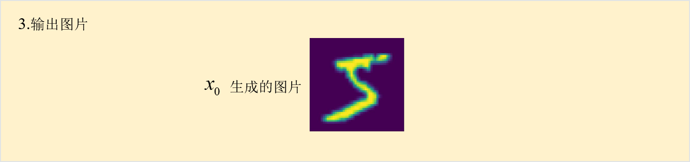
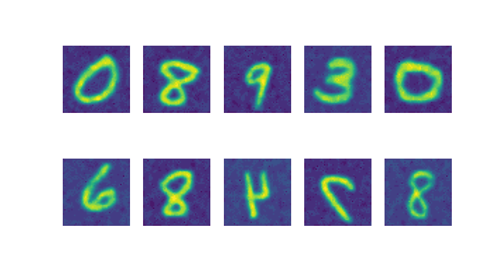

# Difussion Model

- [Difussion Model](#difussion-model)
  - [1. 模型原理](#1-模型原理)
    - [1.1 前向加噪](#11-前向加噪)
    - [1.2 训练UNet](#12-训练unet)
    - [1.3 反向去噪](#13-反向去噪)
  - [2. 实现](#2-实现)
    - [模型训练](#模型训练)
    - [模型效果](#模型效果)
  - [Reference](#reference)


## 1. 模型原理

Diffusion模型的训练可以分为两个部分：

+ **前向扩散过程(Forward Diffusion Process)**---->图片中添加噪声
+ **反向扩散过程(Reverse Diffusion Process)**---->预测图片中的噪声

### 1.1 前向加噪

前向扩散过程是不断往输入图片中添加高斯噪声。




### 1.2 训练UNet

使用UNet预测不同时间步的噪声。



UNet结构



本次复现采用的结构


### 1.3 反向去噪

反向扩散过程是将噪声不断还原为原始图片。







## 2. 实现

基于mnist手写数字数据集的diffusion模型复现

### 模型训练

```
python train.py
```

### 模型效果

可以生成0-9之间的手写数字，该模型只实现了Difussion Model，不能通过引导词生成相应的数字。

通过引导词生成相应的数字可以转到[Stable Diffusion Model](https://github.com/JiaxingSong718/Stable-DiddusionModel)

```
python denoise.py
```



解释生成图片有反的情况：

在dataset预处理使加了`\# transforms.RandomHorizontalFlip(), # PIL图像左右随即反转`是的训练数据的图像发生了反转，在训练时将这句删除可以避免这种情况。

## Reference

[十分钟读懂Diffusion：图解Diffusion扩散模型 - 知乎 (zhihu.com)](https://zhuanlan.zhihu.com/p/599887666)

[pytorch-diffusion](https://github.com/owenliang/pytorch-diffusion)
